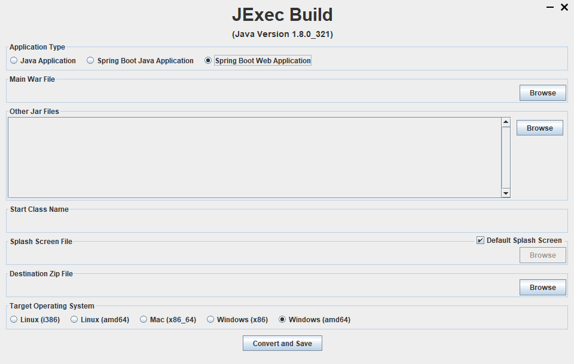

# [JExec Build](https://github.com/saphirepankaj/jexec-build)

## 🛡️ **Secure Your Java Applications with JExec Build**  

**JExec Build** is a robust and reliable tool designed to protect your Java and Spring Boot applications from decompilation and reverse engineering. With its powerful security features, JExec Build ensures your code remains safe and uncompromised.  

### ✅ **Why Choose JExec Build?**  
- **Supports Java 6 and Above:** Compatible with a wide range of Java versions.  
- **Offline Usage:** No internet connection required for operation.  
- **Zero Dependencies:** Lightweight and hassle-free with no external dependencies.  
- **User-Friendly:** Simple and easy-to-use interface for quick application protection.  

Protect your applications effortlessly with **JExec Build** — your reliable partner for Java application security.  



## 🚀 **Quick Start Guide**

Follow these simple steps to get started with **JExec Build** and secure your Java or Spring Boot application.  

### 📥 **Download the Latest Zip File**  
Get the appropriate version for your operating system:  

- **[Download JExec Build](https://github.com/saphirepankaj/jexec-build)**  
    - **Linux**  
      - [64-bit](https://github.com/saphirepankaj/jexec-build/blob/main/linux-amd64.zip)  
      - [32-bit](https://github.com/saphirepankaj/jexec-build/blob/main/linux-i386.zip)  
    - **Mac OS**  
      - [64-bit](https://github.com/saphirepankaj/jexec-build/blob/main/mac-x86_64.zip)  
    - **Windows**  
      - [64-bit](https://github.com/saphirepankaj/jexec-build/blob/main/win-amd64.zip)  
      - [32-bit](https://github.com/saphirepankaj/jexec-build/blob/main/win-x86.zip)  

---

### 🛠️ **Run JExec Build**  
1. Unzip the downloaded file.  
2. Execute the JExec application using the following command:  
    ```bash
    java -jar JExec.jar
    ```  

---

### 🔐 **Secure Your Application**  
To protect your Java or Spring Boot application:  

1. Select the **Application Type**.  
2. Browse and select your **Main JAR/War File**.  
3. Add any additional **Dependency JAR Files**.  
4. Provide the **Main/Start Class Name**.  
5. *(Optional)* Customize the **Splash Screen File**.  
6. Specify the **Destination Zip File** path.  
7. Choose the **Target Operating System**.  
8. Click on **Convert and Save**.  

---

### 🎉 **Success!**  
Your application has been successfully secured and wrapped into the specified destination zip file.  

- Extract the output zip file.  
- Run the newly created **JExec.jar** application.  

Enjoy enhanced protection with **JExec Build**!  

---

## 📌 Frequently Asked Questions (FAQ)

### ❓ **Q: After converting and saving, my latest JAR keeps loading. What should I do?**  
**A:** This issue often occurs when your original JAR contains additional dependent JAR files, typically from a Maven build. To resolve it, follow these steps:  

1. Build your JAR file without including the dependencies (exclude dependencies).  
2. Use the **JExec Build** tool to secure it.  
3. Ensure all necessary dependencies are added to the classpath when running the secured JExec JAR.  

Following these steps should resolve the issue.
